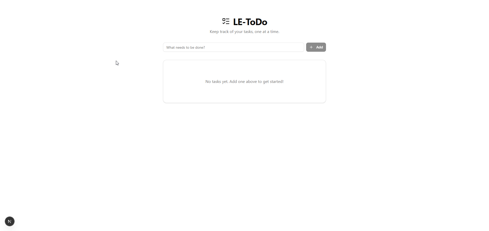

# LE-ToDo

A simple full-stack todo list app.



## Structure

- **LE-ToDo.Api** – ASP.NET Core API (.NET 10), default port `7298`
- **LE-ToDo.BusinessLogic** – Business logic
- **LE-ToDo.DataAccess** – Data access layer
- **LE-ToDo.Tests** – Unit tests
- **le-todo-client** – Next.js 16 frontend (React 19, Tailwind, shadcn/ui)

## Prerequisites

- [.NET 10 SDK](https://dotnet.microsoft.com/download)
- [Node.js](https://nodejs.org/) (for the client)

## Running the app

### 1. API

From the repo root:

```bash
dotnet run --project LE-ToDo.Api
```

API runs at `https://localhost:7298`.

### 2. Client

```bash
cd le-todo-client
npm install
npm run dev
```

Client runs at `http://localhost:3000`.

### 3. Environment

The client calls the API using `NEXT_PUBLIC_API_URL`. Copy `le-todo-client/.env.example` to `le-todo-client/.env.local` and set the API URL (default: `https://localhost:7298`).
